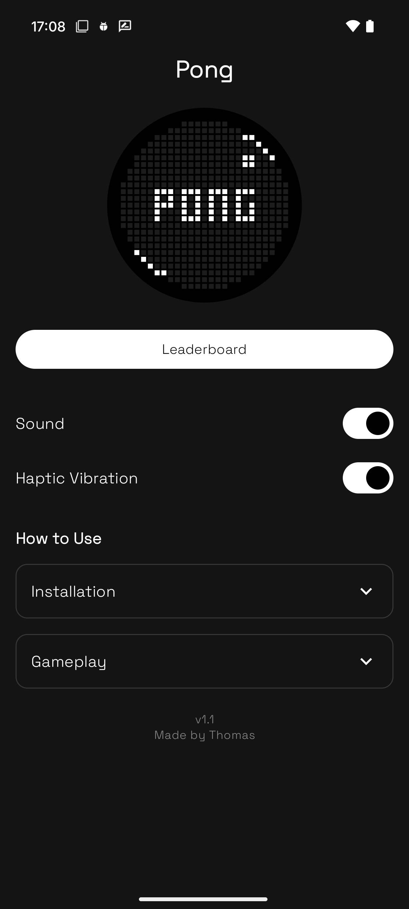

# Pong for the Glyph Matrix

---

## About the Game
Pong for the Glyph Matrix is a modern twist on the classic retro game, designed to run entirely on the Nothing Phone (3)’s unique Glyph Matrix.  
The paddle follows the circular Glyph display while the ball bounces around.

The game features:
- Smooth paddle control using motion sensors
- A bot opponent with increasing difficulty
- High score tracking so you can show off your best runs, with a competitive leaderboard.
- Haptic + sound feedback for extra immersion

---

## The Nothing Phone (3) and the Glyph Matrix
The Nothing Phone (3) is the first device to include the **Glyph Matrix**, a 25×25 LED grid on the back of the phone.  
There are small apps called "toys" which can be playable games, device information or anything you like really.

---

## Why I Made This
I built this game during a **week-long internship at Nothing**.  
My task was to design and prototype a “Glyph Toy” - something fun, simple, and interactive that made the most of the hardware.

The idea of bringing Pong to the Glyph Matrix stuck with me straight away, and after lots of trial and error (and some dodgy paddle physics), it came together into something I’m genuinely proud of.

The Nothing team gave me **really positive feedback**, which made the week even better.

---

## How to Install
1. Download the latest `.apk` from the [Releases](./releases) section.
2. Transfer it to your Nothing Phone (3).
3. On your phone, enable **Install unknown apps** (Settings -> Apps & notifications -> Special app access).
4. Open the APK and install.
5. Once installed, you’ll see **Pong** appear in the Glyph Settings -> Glyph Toys section.

---

## Screenshots
**In Glyph Settings:**  

**Home Page:**  

---

## Animation
Here's the animation used to demo the toy:  
[Lottie Animation](./assets/animation.json)

---

## Credits
Created during my Nothing internship in 2025.  
Built with Kotlin, the Glyph Matrix SDK, and a bit of GitHub Copilot.  
Huge thanks to Nothing for the opportunity, and to [Ken Feng](https://github.com/KenFeng001) for all your help and for developing the SDK.